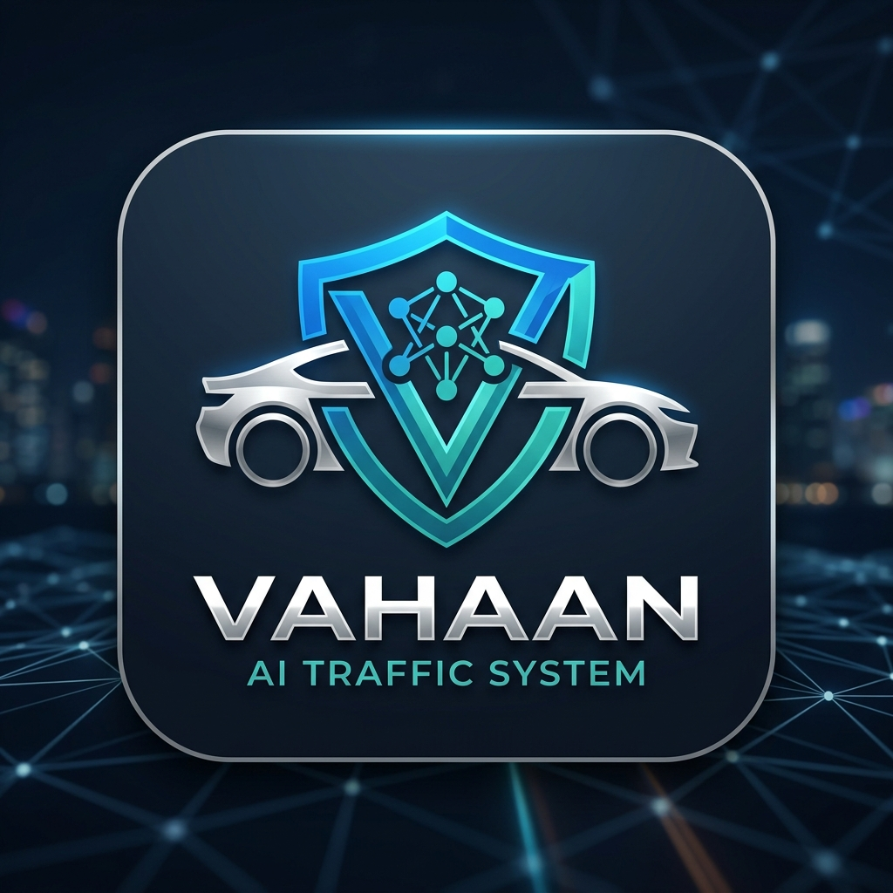

# VAHAAN: Autonomous Vehicle Protection & Enforcement Ecosystem

## 🛡️ Project Identity
**VAHAAN** is a next-generation "self-healing" AI ecosystem designed for autonomous traffic enforcement and transport security. It integrates high-precision computer vision with large language model (LLM) reasoning to resolve real-world traffic ambiguities without constant human intervention.

## 🚀 Key Innovations
- **Agentic Hand-off**: A multi-layered AI architecture where YOLOv8 (Physical Reflex) collaborates with Gemma 4 (Neural Conscience) to audit low-confidence detections.
- **Autonomous Learning Loop**: Human-assisted data is automatically re-ingested into the Neural Core, triggering autonomous retraining milestones every 500 verified images.
- **Digital Judiciary**: A decentralized appeal system that allows citizens to challenge AI rulings, with final adjudication feeding directly back into the model's "moral" weights.
- **High-Throughput Verification**: Rapid micro-tasking for citizen volunteers to verify large-scale (100+) image batches with high precision.

## 🛠️ Technology Stack
- **Backend**: FastAPI (Python), YOLOv8, Ollama (Gemma 4 e2b).
- **Mobile/Web**: Flutter (Dart) with a high-fidelity glassmorphic design system.
- **Intelligence**: Self-learning persistent memory system (`sentinel_memory.json`).

## 📥 Setup & Usage
1. **Initialize Backend**: `python src/api_brain/main.py`
2. **Launch Intelligence Feed**: `flutter run -d chrome`
3. **Neural Audit**: Access the "Sentinel Mind" portal to begin human-assisted grounding.

---
*Developed for future-ready transport infrastructure.*
