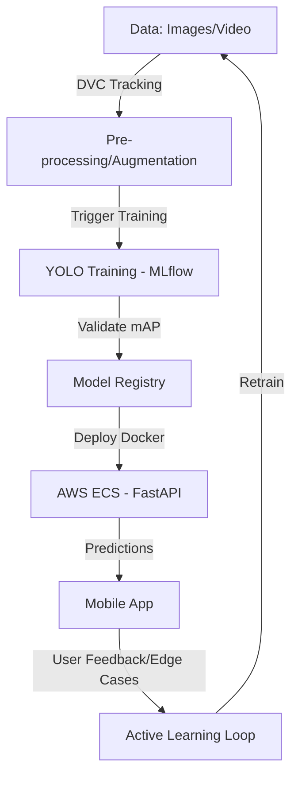

# 🛡️ ARG Project Audit & MLOps Lifecycle Roadmap

This document provides a gap analysis of the current Aequitas RoadGuard (ARG) system and defines the engineering path to transform it from a local prototype into a scalable, MLOps-driven cloud product.

---

## 📊 Current Project Audit (Status 2026-03-31)

### ✅ What is COMPLETED
| Feature | Implementation Detail |
| :--- | :--- |
| **Two-Stage AI Pipeline** | YOLOv11m (Vehicle) ➔ Custom YOLO11 (Plate) ➔ EasyOCR. |
| **Stage 2 Precision** | Plate Sniper trained for 100 epochs (98.8% mAP). |
| **Database Architecture** | 5-table SQLite relational schema (Citizens, Vahan, FASTag, Challans). |
| **Real-Time Video Engine** | ROI Masking, Track-ID persistence, Speed Estimation (Pixels/m). |
| **NLP Narrative** | Template-driven logic for auto-generating legal FIR/Challan text. |
| **Evidence Management** | "Evidence Vault" storing timestamped frames + metadata JSON. |
| **API Layer** | FastAPI backend with endpoints for Detect, Stats, and Profiles. |

### ❌ What is MISSING (Gaps)
| Gap | Impact |
| :--- | :--- |
| **Data Versioning** | No tracking of which images/labels created which model version. |
| **Experiment Tracking** | No record of training loss, hyperparameters, or model history. |
| **Cloud Database** | SQLite is local; cannot handle multi-user mobile traffic. |
| **Modern NLP (LLM)** | Current narratives are static templates, not dynamic/multi-lingual. |
| **Model Serving** | YOLO is running in local Python threads; needs scalable containerization. |
| **Edge Filtering** | No defense against adverse weather (rain/snow) yet. |

---

## 🛠️ MLOps Route Structure (The Roadmap)

To move forward, we must stop thinking about "Scripts" and start thinking about "Pipelines."

### Phase 1: Data & Experiment Management (The Foundation)
1.  **DVC (Data Version Control):** Initialize DVC to track the `2 wheeler`, `cars`, and `weather` datasets. Connect them to an AWS S3 bucket.
2.  **MLflow Integration:** Wrap the training code so every `best.pt` is logged with its precision/recall curves.
3.  **Adverse Weather Retraining:** Use your Raining/Snowing dataset to "Fine-Tune" the Plate Sniper for low-visibility conditions.

### Phase 2: From Templates to True LLM (The NLP Layer)
1.  **Gemini API Integration:** Replace the template engine in `arg_video_engine.py` with a call to **Gemini 1.5 Flash**.
2.  **Multilingual Support:** Allow the LLM to generate challans in Hindi, Gujarati, Tamil, etc., based on the vehicle's RTO state.
3.  **Legal Reasoning:** Teach the LLM to cite specific sections of the *Motor Vehicles (Amendment) Act, 2019*.

### Phase 3: Infrastructure & Scaling (The Cloud Layer)
1.  **Dockerization:** Build a "Golden Image" containing PyTorch, CUDA, YOLO, and FastAPI.
2.  **AWS RDS Migration:** Migrate the 5 SQLite tables to **PostgreSQL on AWS RDS**.
3.  **Inference Server:** Setup an **AWS EC2 g4dn.xlarge** (T4 GPU) to host the Dockerized API.

### Phase 4: Mobile App & Citizen Portal (The Frontend)
1.  **Mobile App:** Build a simple **Flutter** or **React Native** app.
    *   *Role 1 (Officer):* Use camera to scan plates and view Vahan history.
    *   *Role 2 (Citizen):* Upload videos of potholes or "dangerous driving" for reward points.
2.  **Authentication:** Use **Firebase Auth** or **AWS Cognito** to secure the app.

---

## 📈 The Professional MLOps Lifecycle

---

## 🚀 Recommended Next Actions

1.  **LLM Upgrade:** We can swap the static templates for real **Gemini Pro** calls now (requires API key).
2.  **DVC Initialization:** I can write the commands for you to setup Data Versioning in your local folder.
3.  **FastAPI Dockerfile:** I can create the `Dockerfile` so your project is "Cloud Ready" today.

**Which part of this roadmap should we execute first?**
